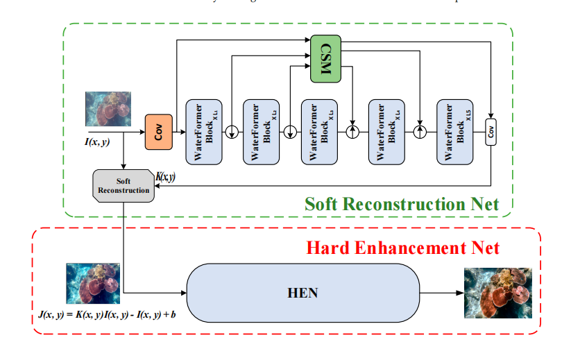

# WaterFormer

**Author**: [*Yuhao Zhang*](https://lupin123123.github.io/) 

**Related Paper**: [*A Two-Stage Network Based on Transformer and Physical
Model for Single Underwater Image Enhancement*](https://www.mdpi.com/2077-1312/11/4/787?type=check_update&version=1) 

**School**: [*Nanjing University of Information Science & Technology*](https://www.nuist.edu.cn/main.htm)

**Notes**: The source code may be modified, and may be slightly different from the model in the original paper.